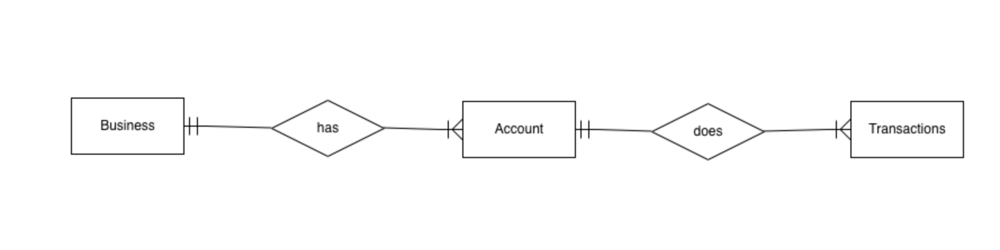

## Amazon QLDB Double Entry Sample App

This sample app is aimed at demonstrating how to model a double entry financial ledger application with QLDB. 

## Table of Contents

   * [Amazon QLDB Double Entry Sample App](#amazon-qldb-double-entry-sample-app)
   * [Setup](#setup)
   * [Tasks](#tasks)
      * [Setting up the Ledger](#setting-up-the-ledger)
      * [Setting up the Tables](#setting-up-the-tables)
      * [TransferMoney](#transfermoney)
   * [Structure of the repository](#structure-of-the-repository)
   * [Key takeaways](#key-takeaways)
   * [Release Notes](#release-notes)
   * [License](#license)
   
## Setup

1. Install Gradle. See [Instructions.](https://gradle.org/install/)

2. Clone the sample app using the following command

   `git clone https://github.com/aws-samples/amazon-qldb-double-entry-sample-java`

3. Make sure you have valid AWS credentials setup. The AWS SDK used in the app will load the credentials automatically as long as you have setup the credentials using one of the methods mentioned in [setup-credentials guide](http://docs.aws.amazon.com/java-sdk/latest/developer-guide/setup-credentials.html)

4. Run the gradle tasks

   `./gradlew run -Dtask=<NameOfTheTask>`

## Tasks
There are three tasks in the sample which help you understand how to use Amazon QLDB:

1. The *Setup Ledger* task helps you understand how to create a ledger using Amazon QLDB API.
2. The *Setup Tables* task will create tables, then create indexes on the tables and finally, will load sample data.
3. The *Transfer Money* task will show a use case of transferring money from one account to another.  This task will show how to query the tables,  how to run transactions and how conflicts are handled.

### Setting up the Ledger

To run this task, do

`./gradlew run -Dtask=SetupLedger`

We perform three actions as part of this task

1. Create Ledger
2. Describe Ledger
3. List Ledgers

We first call the  `CreateLedger` API  of QLDB, which starts the ledger creation process. At this point of time, the status of the ledger will be  `CREATING` as QLDB takes short amount of time to create the ledger.

In order to confirm if the ledger creation is complete, we poll QLDB via `DescribeLedger` API, at a fixed interval  and check if the status has changed to `ACTIVE`. Once the status changes to `ACTIVE`, we are sure that the ledger creation has succeeded.

Finally, we use the `ListLedgers` API to list all the ledgers that we have created up until now.

### Setting up the Tables
To run this task, do:

`./gradlew run -Dtask=SetupTables`

We perform three actions as part of this task:

1. Create Tables
2. Create Indexes
3. Load Sample Data

For this sample app, we have three tables:

1. **Businesses**: This table stores the data about the businesses like name, address, etc...  Each business will have one or more accounts associated with it.
2. **Accounts**: Stores account data like account Id, type of account, balances etc. Each account is associated with a business.
3. **Transactions**: This table acts as an accounting journal. For every transfer of money, we create a single entry that shows the accounts debited and credited. 

*Note: In Accounting, double entry is a concept where for each transaction(in our case transfer of money), we record two entries in the journal. One debit entry to show deduction from Sender account and another credit entry to show increment in the receiver account.*

*As Amazon QLDB uses documents to store the data,  we can create a single document which club together the debit and credit entries. This gives us the ability to view the transaction on the whole with just one entry.*

*Furthermore, using this model gives a flexibility to extend the document to accommodate compound entries, which is used to record a transfer where multiple credit accounts and/or multiple debit accounts are involved*

#### Schema

The attributes of the tables are

 Businesses          | Accounts | Transactions 
------------------- | ---------- | --------
 Name                | Account Id | Sender Account Entry\*
 Registered Address | Business Id | Receive Account Entry\*
 Business Id        | Account Type | 
 Date of registration         | Balances |
 

\*The sender account and receiver account entries will each have following attributes

1. Account Id
2. Transaction Type (Debit or Credit)
3. Amount
4. Currency
5. Notes

We also create following indexes:

1. Business Table:  *BusinessId* 
2. Accounts Table: *AccountId*,  *BusinessId*

Read more about QLDB indexes in our [developer guide](https://docs.aws.amazon.com/qldb/latest/developerguide/ql-reference.create-index.html)

### TransferMoney

To run this task, do

`./gradlew run -Dtask=TransferMoney --args <Name of the Argument Eg: runSingleTransfer>` 

This task also takes additional argument to indicate the kind of transfer to be done. There are two types supported:

1. **runSingleTranfer**: This demonstrates a simple use case of making only one transfer between two accounts. There are no conflicting transfers happening in the system.
2. **runParallelTransfers**: This demonstrates a complex use case of multiple transfers (3 in this case) happening at the same time between 3 accounts. Some transfers might run into [OCC errors] (https://docs.aws.amazon.com/qldb/latest/developerguide/concurrency.html)

To transfer the amount we perform the following steps as a part of a single Amazon QLDB transaction

1. Read the Balances of the Sender Account
2. Read the Balances of the Receiver Account
3. Check if Sender Account and Receiver Accounts support the currency and Sender Account has balance more than the requested transfer amount
4. Once the above checks pass, we create an entry in the Transactions table 
5. Calculate and update the balance of Sender Account
6. Calculate and update the balance of Receiver Account

When there are multiple transfers happening in the system, if there is an OCC while committing the transaction, then the QLDB Driver (or specifically, QLDB session) takes care of retrying the
entire transaction. The failed transaction will start again from, reading the balances, doing the business validations again with the new values, and then updating the balances to the correct values. If this attempt fails as well, the driver will retry all over again.

The driver will keep retrying till either the transaction succeeds or it hits the maximum retry attempt limit (specified when instantiating the *PooledQLDBDriver*).

## Structure of the repository

**Tasks**: This module contains all the classes that can be executed from the command line. These also serve as entry points into the application. You can run any task as follows:

`./gradlew run -Dtask=<NameOfTheTask>`

**actions**: All the classes that interact with QLDB.

**models**: Contains the classes for models for the tables in QLDB.

**models/qldb**: Contains classes to map QLDB models.

**helper**: Contains all helper classes.

## Key takeaways

1. We leverage the document model of Amazon QLDB to create a single document in the transactions table to record a transfer instead of creating two different entries. This also provides flexibilty of extending the model to accommodate compound accounting entries in future.
2. Using the *execute* convenience method, a QLDB session (via the driver) makes it easy to handle OCC exceptions. The method ensures that all the steps in the transaction block that is passed to the method will be retried, and the commit will be attempted again in the event of an OCC conflict exception.

## Release Notes

**Release 1.0**

* Initial preview release of the Amazon QLDB double entry  sample application.

## License

This library is licensed under [the MIT-0 License](https://github.com/aws/mit-0).

